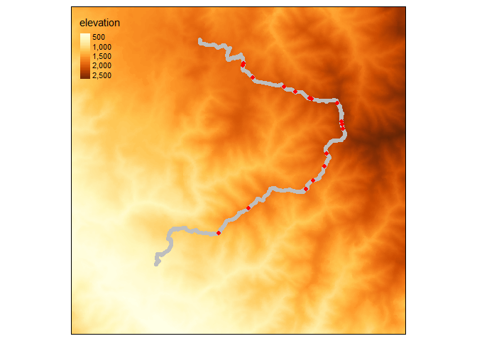

<!-- README.md is generated from README.Rmd. Please edit that file -->

# track2dm

<!-- badges: start -->
<!-- badges: end -->

The goal of track2dm is to create detection matrix from transect lines
that account for topography variability. The detection matrix is usually
used for hierarchical modelling of species occupancy and distribution
(see MacKenzie et al., 2004 about occupancy modelling).

## Installation

You can install the released version of track2dm and the development
version from [GitHub](https://github.com/) with:

``` r
# install.packages("devtools")
devtools::install_github("ilubis85/track2dm")
```

## Example

We have provided some dataset to play with to understand how the package
works. Three types of data are needed, the track where the survey is
recorded spatially, the observation along the tracks and elevation as
raster data downloaded from USGS website.

``` r
# LOAD ALL DATA
# Read elevation raster data from the package
data("elevation")

# Read a survey track from the package
data("track")

# Read the observation from the package
data("observation")

# Convert dataframe (track and observation to spatial points data-frame)
track_pt <- track2dm::df2sp(track, UTMZone = "+proj=utm +zone=47 +datum=WGS84 +units=m +no_defs")
observation_pt <- track2dm::df2sp(observation, UTMZone = "+proj=utm +zone=47 +datum=WGS84 +units=m +no_defs")
```

Track is a dataframe contains date and time, X, Y and usually Z
information downloaded from GPS. Whilst observation is a dataframe
contains any information about the observed species. The elevation is
needed to extract Z values to calculate distance in three dimension
(3D).

``` r
head(track, 5)
#>               DateTime        X        Y      Z
#> 1 2015-09-10T06:27:25Z 353210.3 406622.9 627.88
#> 2 2015-09-10T06:27:31Z 353199.2 406636.3 631.24
#> 3 2015-09-10T06:27:37Z 353197.0 406651.3 634.61
#> 4 2015-09-10T06:27:42Z 353197.3 406672.5 638.45
#> 5 2015-09-10T06:27:47Z 353202.3 406685.7 642.30
head(observation, 5)
#>              DateTime    Type                       Age      X      Y
#> 1 2015-09-11 14:33:52 Cakaran Cukup baru (1 - 2 minggu) 355976 408028
#> 2 2015-09-12 14:34:55 Kotoran       Lama (2 - 4 minggu) 357296 409119
#> 3 2015-09-13 14:45:52 Kotoran Cukup baru (1 - 2 minggu) 359839 409959
#> 4 2015-09-13 15:27:25 Kotoran Cukup baru (1 - 2 minggu) 360145 410343
#> 5 2015-09-14 09:18:16 Kotoran Cukup baru (1 - 2 minggu) 360633 410947
#>   Observation
#> 1 Tanda Satwa
#> 2 Tanda Satwa
#> 3 Tanda Satwa
#> 4 Tanda Satwa
#> 5 Tanda Satwa
```

This figure below shows what the data look like when we plot them using
tmap package. The data is used with permission from WCS Indonesia and
the data has been published in journal of (TO BE UPDATED)!!.

<div class="figure" style="text-align: center">


<p class="caption">
Survey tracks and points with elevation information
</p>

</div>

So how the package works? Below is the list of functions currently
developed to create detection matrix for a species.

<table class="table" style="margin-left: auto; margin-right: auto;">
<thead>
<tr>
<th style="text-align:left;">
Function
</th>
<th style="text-align:left;">
Purpose
</th>
<th style="text-align:left;">
Arguments/inputs
</th>
</tr>
</thead>
<tbody>
<tr>
<td style="text-align:left;">
timeFormat()
</td>
<td style="text-align:left;">
reformat time
</td>
<td style="text-align:left;">
myString, addTime
</td>
</tr>
<tr>
<td style="text-align:left;">
df2Spatial()
</td>
<td style="text-align:left;">
Convert dataframe to spatial object dataframe
</td>
<td style="text-align:left;">
dataFrame, UTMZone
</td>
</tr>
<tr>
<td style="text-align:left;">
meanPoint()
</td>
<td style="text-align:left;">
Calculate the means of points
</td>
<td style="text-align:left;">
dataFrame, nPoint
</td>
</tr>
<tr>
<td style="text-align:left;">
clearPoint()
</td>
<td style="text-align:left;">
Clear the points from points
</td>
<td style="text-align:left;">
dataFrame, UTMZone, distLength
</td>
</tr>
<tr>
<td style="text-align:left;">
dist3D()
</td>
<td style="text-align:left;">
Calculate distance based on X, Y, and Z information from a dataframe
</td>
<td style="text-align:left;">
dataFrame, elevData, repLength
</td>
</tr>
<tr>
<td style="text-align:left;">
speciesDM()
</td>
<td style="text-align:left;">
Extract detection matrix from the species observation
</td>
<td style="text-align:left;">
speciesDF, speciesCol, species, extractVars
</td>
</tr>
</tbody>
</table>

## 1. Prepare track and observation points (to be updated)

## 2. Calculate distance (to be updated)

## 3. Extract detection matrix for species (to be updated)
