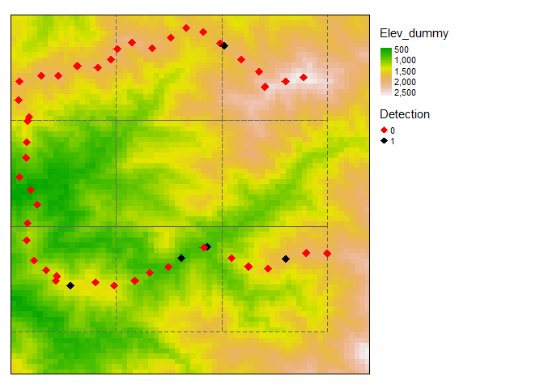

<!-- README.md is generated from README.Rmd. Please edit that file -->

# track2dm : Membuat matriks deteksi untuk analisis okupansi satwa dari survei transek

<!-- badges: start -->
<!-- badges: end -->

## Analisis okupansi

Para peneliti satwa liar seringkali menghadapi tantangan dalam
menentukan keberadaan spesies dalam sebuah bentang alam. Berbagai
kondisi seperti cuaca, karakteristik lanskap, pengalaman pengamat, dan
sebagainya menjadi penghambat dalam mendeteksi satwa. Misalnya karena
tebalnya serasah hutan, peneliti kesulitan mendeteksi satwa terestrial
karena tidak meninggalkan jejak pada serasah. Hal ini bisa berarti dua
hal: satwa tersebut ada tetapi tidak terdeteksi (*False absence*) atau
bisa jadi satwa tersebut memang tidak menghuni daerah tersebut (*True
absence*).

Oleh karena kehadiran spesies tertentu terutama satwa liar yang terus
bergerak tidak bisa dideteksi secara sempurna, hal ini menjadi tantangan
tersendiri khususnya untuk menjawab pertanyaan apakah satwa liar
tersebut menghuni daerah tersebut atau tidak.

Pada tahun 2002, MacKenzie et al. ([2002](#ref-MacKenzie2002))
memperkenalkan model statistik yang mampu mengestimasi probabilitas
keberadaan atau kehadiran spesies tertentu yang juga memperhitungkan
probabilitas deteksi yang tidak sempurna tersebut. Detektabilitas
species dapat diestimasi melalui pengamatan berulang di setiap
unit/situs ([Bailey and Adams 2005](#ref-Bailey2005)). Pengamatan
berulang ini dapat berupa pengamatan yang diambil saat survei
menggunakan transek (disebut **replikasi spasial**) atau pengamatan yang
diambil pada tempat yang sama dengan waktu yang berulang (**replikasi
temporal**).

## Replikasi spasial

Beberapa penelitian yang bertujuan untuk mengestimasi tingkat hunian
satwa tertentu dilakukan menggunakan survei transek. Sebagai contoh,
Wibisono et al. ([2011](#ref-Wibisono2011)) mengestimasi tingkat hunian
harimau sumatra di hampir keseluruhan hutan yang tersisa di pulau
Sumatra. Penelitian ini menggunakan survei berbasi transek, di mana
dalam satu unit sampling (petak berukuran 17km x 17 km), survei
keberadaan harimau berdasarkan tanda kehadiran (tapak, kotoran, kaisan,
dll) dilakukan dalam transek sepanjang 4-40++ km.

## Matriks deteksi

Idealnya, transek dipilih secara acak, dan spesies diamati sepanjang
jalur tersebut. Panjang transek harus cukup untuk menghitung deteksi dan
keberadaan spesies. Kemudian, untuk analisis data, data hasil pengamatan
akan dibagi berdasarkan jumlah usaha, dalam hal ini adalah panjang
transek. Panjang transek biasanya disesuaikan dengan ekologi dan
pergerakan spesies. Misalnya untuk analisis okupansi harimau, Wibisono
et all. ([2011](#ref-Wibisono2011)) menggunakan panjang transek 5 km.
Jadi dalam setiap unit analisis (petak 17km x 17km), data temuan dibagi
ke dalam transek 5km.

Namun, membagi transek yang panjang menjadi beberapa transek dengan
ukuran yang sama itu tidak mudah, terutama ketika harus mempertimbangkan
topografi untuk menghindari bias dalam pengukuran upaya survei. Saat
ini, belum ada aplikasi yang menyediakan alat untuk tujuan ini, kecuali
yang membagi garis menjadi panjang yang sama di ArcGIS atau perangkat
lunak GIS lainnya, tetapi belum mempertimbangan topografi (Z).

## track2dm

Untuk bisa menghasilkan panjang transek yang sama yang juga
mempertimbakan bentuk muka bumi, Lubis et al, (in prep) mengembangkan
pustaka dalam software R yang disebut **track2dm**. Tujuan utama
pengembangan pustaka ini adalah untuk memudahkan pembuatan matriks
deteksi dari survei berbasis transek, dengan memperhitungkan bentuk muka
bumi.

Berikut ini adalah tutorial bagaimana pustaka track2dm digunakan untuk
mengkonversi data survei lapangan menjadi matriks deteksi yang
dibutuhkan dalam analisis pemodelan okupansi.

## Bagaimana menginstall track2dm?

Track2dm dapat diinstall melalui [GitHub](https://github.com/) dengan
mengetik skrip R seperti di bawah ini:

``` r
# install.packages("devtools")
devtools::install_github("ilubis85/track2dm")
```

## Bagaimana cara kerjanya?

Dalam pustaka track2dm, terdapat contoh data untuk tujuan simulasi yakni
data hasil pengamatan, yang mencatat data kehadiran satwa sepanjang
jalur transek dalam format Ms. Excell.

Sementara untuk mendapatkan nilai Z atau ketinggian, diperlukan nilai
elevasi dari Digital Elevation Model (DEM).

``` r
# Memanggil data
# Data observasi
data("occu_survey")

# Memanggil data elevasi
library(terra)
elevation <- rast("D:/WCS_domain/Training_track2dm_Bogor_2023/Data_spasial/Elev_dummy.tif")
names(elevation) <- names('Elevasi')
```

Pada data *occu_survey*, data survei disimpan sebagai data.frame dan
terdiri dari informasi seperti tanggal, waktu, koordinat X dan Y, serta
informasi relevan lainnya yang terkait dengan spesies yang diamati,
biasanya diperoleh dari perangkat GPS. Penting untuk dicatat bahwa data
elevasi (*elevation*) diperlukan untuk mengekstraksi nilai ketinggian
(Z), yang memungkinkan perhitungan jarak dalam tiga dimensi (3D) selama
proses konversi.

``` r
head(occu_survey, 5)
#>   No   Grid_ID Leader            DateTime Wp_Id Km Meter Species        X
#> 1  1 KELN26W33    MIL 2019-02-22 09:30:00    18  1     0       - 289911.2
#> 2  2 KELN26W33    MIL 2019-02-22 11:53:00    19  1   200       - 289853.0
#> 3  3 KELN26W33    MIL 2019-02-22 14:16:00    20  1   400       - 289695.9
#> 4  4 KELN26W33    MIL 2019-02-23 11:05:00    21  1   600       - 289498.5
#> 5  5 KELN26W33    MIL 2019-02-23 12:36:00    22  1   800       - 289304.3
#>          Y  Types Canopy Age Certnty Habitat Anml_tr Substrt Rain
#> 1 430077.9 Canopy     96   -       -     OTH       -    Thin  Yes
#> 2 430277.8 Canopy     16   -       -     FOR       -   Thick  Yes
#> 3 430404.1 Canopy      5   -       -     FOR       -   Thick  Yes
#> 4 430438.3 Canopy     20   -       -     FOR       -   Thick  Yes
#> 5 430494.0 Canopy      3   -       -     FOR       -   Thick  Yes
```

*Acknowledgment*: Data yang digunakan dalam pustaka ini berasal dari
survei nyata (Lubis et al. ([2023](#ref-10.3389/fevo.2023.1174708)))
tetapi telah dimodifikasi untuk tujuan praktik. Saya ingin mengakui
sumber asli data tersebut dan menyampaikan rasa terima kasih atas izin
yang diberikan untuk menggunakan dan memodifikasinya untuk pengembangan
dan demonstrasi pustaka track2dm.

Pustaka track2dm memiliki beragam fungsi untuk memudahkan dalam membuat
matriks deteksi seperti yang terlihat pada tabel berikut.

    #> 
    #> Attaching package: 'knitr'
    #> The following object is masked from 'package:terra':
    #> 
    #>     spin

<table class="table" style="margin-left: auto; margin-right: auto;">
<thead>
<tr>
<th style="text-align:left;">
Fungsi
</th>
<th style="text-align:left;">
Manfaat
</th>
</tr>
</thead>
<tbody>
<tr>
<td style="text-align:left;">
dist3D()
</td>
<td style="text-align:left;">
Menghitung jarak antar titik berdasarkan nilai X, Y, dan Z (ketinggian)
</td>
</tr>
<tr>
<td style="text-align:left;">
spatialDM()
</td>
<td style="text-align:left;">
Membuat matriks deteksi dari data hasil pengamatan dalam jalur/transek
</td>
</tr>
<tr>
<td style="text-align:left;">
makeGrids()
</td>
<td style="text-align:left;">
Membuat gridcell atau petak dari dalam format spasial
</td>
</tr>
<tr>
<td style="text-align:left;">
sliceGrids()
</td>
<td style="text-align:left;">
Membagi gridcell atau petak menjadi beberapa bagian kecil
</td>
</tr>
<tr>
<td style="text-align:left;">
spatialDM_grid()
</td>
<td style="text-align:left;">
Membuat matriks deteksi dari hasil pengamatan dalam transek pada setiap
gridcell atau petak.
</td>
</tr>
<tr>
<td style="text-align:left;">
track2points()
</td>
<td style="text-align:left;">
Menggabungkan data waypoint dan trek menjadi multipoint yang berurutan
berdasarkan ID atau waktu pengamatan
</td>
</tr>
<tr>
<td style="text-align:left;">
dm2spatial()
</td>
<td style="text-align:left;">
Konversi deteksi mariks menjadi data spasial untuk memudahkan dalam
validasi data
</td>
</tr>
</tbody>
</table>

Tujuan utama tutorial ini adalah untuk membuat matriks deteksi
menggunakan data hasil pengamatan yang dilakukan di sepanjang
jalur/transek. Biasanya data kehadiran (*presence and absence*) spesies
diambil pada interval tertentu pada transek, misalnya setiap 200 meter,
kemudian diinput ke dalam excell.

Namun dalam beberapa kasus, hanya data kehadiran satwa saja yang
dicatat, sementara data ketidakhadiran satwa tidak dicatat. Tipe data
seperti ini cukup banyak misalnya data patroli hutan, sehingga untuk
membuat matriks deteksi dari data seperti ini perlu perlakuan tambahan,
yakni mendijitasi jalur transek menggunakan applikasi GIS.

Kedua tipe data ini akan digunakan untuk membuat matriks deteksi.

## 1. Membuat matriks deteksi dari hanya satu jalur pengamatan

Untuk membuat matriks deteksi dari sebuah garis transek tunggal, langkah
pertama adalah menghitung jarak antara titik-titik sepanjang garis
transek sambil mempertimbangkan perbedaan topografi menggunakan fungsi
**dist3D()**. Kemudian, bagi garis tersebut menjadi segmen-segmen dengan
panjang yang telah ditentukan. Terakhir, konversi garis yang telah
dibagi menjadi matriks deteksi menggunakan fungsi **speciesDM()**, yang
memberikan nilai kehadiran (1) atau ketidakhadiran (0) untuk setiap unit
berdasarkan data spesies yang diamati.

``` r

# Load library
library(tidyverse)

# Cek data 
head(occu_survey, 5) 
#>   No   Grid_ID Leader            DateTime Wp_Id Km Meter Species        X
#> 1  1 KELN26W33    MIL 2019-02-22 09:30:00    18  1     0       - 289911.2
#> 2  2 KELN26W33    MIL 2019-02-22 11:53:00    19  1   200       - 289853.0
#> 3  3 KELN26W33    MIL 2019-02-22 14:16:00    20  1   400       - 289695.9
#> 4  4 KELN26W33    MIL 2019-02-23 11:05:00    21  1   600       - 289498.5
#> 5  5 KELN26W33    MIL 2019-02-23 12:36:00    22  1   800       - 289304.3
#>          Y  Types Canopy Age Certnty Habitat Anml_tr Substrt Rain
#> 1 430077.9 Canopy     96   -       -     OTH       -    Thin  Yes
#> 2 430277.8 Canopy     16   -       -     FOR       -   Thick  Yes
#> 3 430404.1 Canopy      5   -       -     FOR       -   Thick  Yes
#> 4 430438.3 Canopy     20   -       -     FOR       -   Thick  Yes
#> 5 430494.0 Canopy      3   -       -     FOR       -   Thick  Yes

# Hitung jarak 3 dimensi (X, Y, and Z) 
occu_dist <- track2dm::dist3D(dataFrame = occu_survey, Xcol = "X",
                              Ycol = "Y", elevData = elevation,
                              repLength = 2000)

# Membuat matriks deteksi
rusa_dm <- track2dm::spatialDM(speciesDF = occu_dist, sortID = 'DateTime', 
                               Xcol = 'X', Ycol = 'Y', whichCol = 'Species',
                               whichSp = 'RUU', samplingCov = 'Habitat',
                               samplingFun = track2dm::myModal)

# Cek hasil matriks deteksi
head(rusa_dm, 2)
#>          R1 R2 R3 R4 R5 R6 R7 R8 R9 R10 R11 R12 R13 R14 R15 R16 R17 R18 R19 R20
#> Presence  1  0  1  0  1  0  0  1  0   0   0   0   0   0   0   0   0   0   0   0
#>          R21 R22 R23 Habitat_1 Habitat_2 Habitat_3 Habitat_4 Habitat_5
#> Presence   1   0   0       FOR       FOR       FOR       FOR       OTH
#>          Habitat_6 Habitat_7 Habitat_8 Habitat_9 Habitat_10 Habitat_11
#> Presence       OTH       FOR       FOR       FOR        FOR        FOR
#>          Habitat_12 Habitat_13 Habitat_14 Habitat_15 Habitat_16 Habitat_17
#> Presence        FOR        FOR        FOR        FOR        FOR        FOR
#>          Habitat_18 Habitat_19 Habitat_20 Habitat_21 Habitat_22 Habitat_23
#> Presence        FOR        FOR        FOR        FOR        FOR        FOR
#>                             XY_1                    XY_2
#> Presence 288940.5218_430648.4618 288169.2026_430683.9968
#>                             XY_3                    XY_4                   XY_5
#> Presence 286027.2384_430446.1653 284403.1159_429982.9146 282282.6033_431038.516
#>                             XY_6                    XY_7
#> Presence 280852.2777_430335.2364 279245.7951_429530.9964
#>                             XY_8                    XY_9
#> Presence 275804.3118_429198.1208 275603.9961_429309.2033
#>                            XY_10                   XY_11
#> Presence 275024.9905_429783.7306 273732.2214_431147.9017
#>                            XY_12                   XY_13
#> Presence 274097.1564_432756.9424 273394.3116_434316.3478
#>                            XY_14                  XY_15                   XY_16
#> Presence 273775.3216_436180.3531 273347.738_437975.6749 274433.5663_439109.7857
#>                            XY_17                   XY_18
#> Presence 276347.6368_439535.2321 277826.7936_440032.4256
#>                            XY_19                   XY_20
#> Presence 279284.1554_440459.0247 280970.2812_441081.7168
#>                            XY_21                   XY_22
#> Presence 283082.4364_440526.7529 284268.2716_439666.8053
#>                            XY_23
#> Presence 285543.2928_438674.5721
```

Dengan menggunakan panjang replikasi 2 km, total 23 replikasi
dihasilkan, yang menunjukkan kehadiran (1) atau ketidakhadiran (0)
spesies rusa (**RUU**). Kode yang disediakan juga menghasilkan kovariat
survei, seperti habitat (FOR untuk hutan) di mana pengamatan dilakukan.

Koordinat X dan Y dapat digunakan untuk membuat representasi visual dari
matriks deteksi untuk tujuan peninjauan hasil. Ini dapat dilakukan
dengan mengkonversi matriks deteksi menjadi data spasial menggunakan
fungsi **dm2spatial()**. Dataframe yang dihasilkan kemudian dapat
diplotkan pada peta menggunakan pustaka *tmap*.

    #> The legacy packages maptools, rgdal, and rgeos, underpinning the sp package,
    #> which was just loaded, will retire in October 2023.
    #> Please refer to R-spatial evolution reports for details, especially
    #> https://r-spatial.org/r/2023/05/15/evolution4.html.
    #> It may be desirable to make the sf package available;
    #> package maintainers should consider adding sf to Suggests:.
    #> The sp package is now running under evolution status 2
    #>      (status 2 uses the sf package in place of rgdal)

<div class="figure" style="text-align: left">


<p class="caption">
Titik titik yang menunjukkan kehadiran (titik hitam) dan ketidakhadiran
(titik merah) satwa rusa pada setiap replikasi spasial berukuran 2km
</p>

</div>

## 2. Membuat matriks deteksi dari beberapa jalur pengamatan

Pada contoh ini, matriks deteksi untuk rusa mencerminkan pengamatan dari
satu jalur pengamatan. Bagaimana jika deteksi matriks dibuat dari
beberapa jalur pengamatan?

Untuk tutorial selanjutnya, data observasi akan dibagi menjadi beberapa
bagian dengan menggunakan petak acak yang lebih kecil. Hal ini dapat
dilakukan dengan membagi area survei menjadi beberapa gridcell (petak)
menggunakan fungsi **makeGrids()**, kemudian matriks deteksi akan
dihasilkan sekaligus untuk kesemua petak dengan menggunakan perintah
**spatialDM_grid**.

``` r

# Membuat gridcell atau petak 5km 
grid_5km <- track2dm::makeGrids(spObject = rusa_dm_sp, cellSize = 5000, clip = TRUE)

# Konversi data okupansi menjadi data spasial
occu_survey_sf <- sf::st_as_sf(x = occu_survey, coords = c("X", "Y"), 
                               crs = terra::crs(elevation))

# Membuat matriks deteksi dari data okupansi
rusa_grids_dm <- track2dm::spatialDM_grid(spData = occu_survey_sf, 
                                          sortID = "DateTime",
                                          Xcol = "X", Ycol = "Y", 
                                          whichCol = "Species",
                                          whichSp = "RUU", 
                                          samplingCov = "Habitat",
                                          samplingFun = track2dm::myModal, 
                                          repLength = 1000,
                                          gridCell = grid_5km, 
                                          subgridCol = "Grid_id",
                                          elevData = elevation)

# Cek hasil matriks deteksi
rusa_grids_dm
#>   Grid_ID R1 R2 R3   R4   R5   R6   R7   R8   R9  R10  R11 Habitat_1 Habitat_2
#> 1       1  0  0  0    0    0    0    0 <NA> <NA> <NA> <NA>       FOR       FOR
#> 2       2  0  0  0 <NA> <NA> <NA> <NA> <NA> <NA> <NA> <NA>       FOR       FOR
#> 3       3  0  0  1    0    0    0    0    0    0    0    0       FOR       FOR
#> 4       4  0  1  1    0    0    0 <NA> <NA> <NA> <NA> <NA>       FOR       OTH
#> 5       5  0  0  1    0    0    0 <NA> <NA> <NA> <NA> <NA>       FOR       FOR
#>   Habitat_3 Habitat_4 Habitat_5 Habitat_6 Habitat_7 Habitat_8 Habitat_9
#> 1       FOR       FOR       FOR       FOR       FOR      <NA>      <NA>
#> 2       FOR      <NA>      <NA>      <NA>      <NA>      <NA>      <NA>
#> 3       FOR       FOR       FOR       FOR       FOR       FOR       FOR
#> 4       OTH       OTH       FOR       FOR      <NA>      <NA>      <NA>
#> 5       FOR       FOR       FOR       FOR      <NA>      <NA>      <NA>
#>   Habitat_10 Habitat_11                    XY_1                    XY_2
#> 1       <NA>       <NA> 273394.3116_434316.3478 273717.4516_435228.0567
#> 2       <NA>       <NA> 284735.9764_439124.9997  285351.871_438619.7194
#> 3        FOR        FOR 278224.0023_429364.4278 277165.2361_429225.6069
#> 4       <NA>       <NA> 283241.1708_430572.3858  282282.6033_431038.516
#> 5       <NA>       <NA> 288169.2026_430683.9968 286959.7673_430738.9672
#>                      XY_3                    XY_4                    XY_5
#> 1 273775.3216_436180.3531 273848.6687_437151.0455  273347.738_437975.6749
#> 2 286367.7547_438961.4365                    <NA>                    <NA>
#> 3 275804.3118_429198.1208  275323.6619_429509.576 275157.3134_429629.7958
#> 4 281065.5871_430503.7117 280707.0907_430267.9863  279709.6052_429932.375
#> 5 286027.2384_430446.1653 285359.8687_430066.7414 284403.1159_429982.9146
#>                      XY_6                    XY_7                    XY_8
#> 1 273498.1993_438930.8169 274433.5663_439109.7857                    <NA>
#> 2                    <NA>                    <NA>                    <NA>
#> 3 274457.6831_429987.8683   273888.67_430763.4766 273844.7378_431737.5257
#> 4  278862.855_429402.8614                    <NA>                    <NA>
#> 5 283460.0475_430482.7854                    <NA>                    <NA>
#>                      XY_9                  XY_10                   XY_11
#> 1                    <NA>                   <NA>                    <NA>
#> 2                    <NA>                   <NA>                    <NA>
#> 3 273921.0447_432665.1982 274175.7902_433371.226 273535.6252_434057.9229
#> 4                    <NA>                   <NA>                    <NA>
#> 5                    <NA>                   <NA>                    <NA>
```

Hasil matriks deteksi kemudian dapat divisualisasikan sama seperti
sebelumnya.

``` r
# Konversi matriks deteksi menjadi data spasial
rusa_dm_grid_sp <- track2dm::dm2spatial(detectMatrix = rusa_grids_dm, 
                                        spProject = terra::crs(elevation))

# Visualize the detection matrix
library(tmap)
tm_shape(elevation) +
  tm_raster(style = "cont", palette = terrain.colors(8)) +
  tm_shape(grid_5km) + tm_borders(lty=2)+
  tm_shape(rusa_dm_grid_sp) + tm_dots(col = 'Detection', palette = c("red", "black"), shape=18, size=0.5)+
  tm_layout(legend.outside = TRUE)
```

<div class="figure" style="text-align: left">


<p class="caption">
Titik titik yang menunjukkan kehadiran (titik hitam) dan ketidakhadiran
(titik merah) satwa rusa pada setiap replikasi spasial berukuran 1km
</p>

</div>

Gambar 2 di atas menampilkan matriks deteksi yang diperoleh dari lima
sel grid dengan ukuran 5km di mana survei dilakukan. Matriks ini terdiri
dari lima baris yang mewakili pengamatan dari setiap sel grid, dengan
maksimal sebelas replikasi (R11) untuk setiap pengamatan.

Matriks deteksi ini kemudian dapat langsung digunakan untuk pemodelan
okupansi yang akan menghasilkan probabilitas keberadaan spesies dengan
memperhitungkan probabilitas deteksi.

## 3. Membuat matriks deteksi dari data pengamatan yang hanya mengumpulkan titik keberadaan spesies

*TO BE CONTINUED :)*

### References

<div id="refs" class="references csl-bib-body hanging-indent">

<div id="ref-Bailey2005" class="csl-entry">

Bailey, Larissa, and Michael Adams. 2005.
“<span class="nocase">Occupancy models to study wildlife</span>.” *US
Geological Survey*, no. September: 6.
<https://doi.org/10.1177/0269881115570085>.

</div>

<div id="ref-10.3389/fevo.2023.1174708" class="csl-entry">

Lubis, Muhammad I, Janice S H Lee, U M Rahmat, Tarmizi, Eka Ramadiyanta,
Dewi Melvern, Sasha Suryometaram, et al. 2023.
“<span class="nocase">Planning for megafauna recovery in the tropical
rainforests of Sumatra</span>.” *Frontiers in Ecology and Evolution* 11.
<https://doi.org/10.3389/fevo.2023.1174708>.

</div>

<div id="ref-MacKenzie2002" class="csl-entry">

MacKenzie, Darryl I., James D. Nichols, Gideon B. Lachman, Sam Droege,
Andrew A. Royle, and Catherine A. Langtimm. 2002.
“<span class="nocase">Estimating site occupancy rates when detection
probabilities are less than one</span>.” *Ecology* 83 (8): 2248–55.
[https://doi.org/10.1890/0012-9658(2002)083\[2248:ESORWD\]2.0.CO;2](https://doi.org/10.1890/0012-9658(2002)083[2248:ESORWD]2.0.CO;2).

</div>

<div id="ref-Wibisono2011" class="csl-entry">

Wibisono, Hariyo T, Matthew Linkie, Gurutzeta Guillera-Arroita, Joseph A
Smith, Sunarto, Wulan Pusparini, Asriadi, et al. 2011.
“<span class="nocase">Population Status of a Cryptic Top Predator: An
Island-Wide Assessment of Tigers in Sumatran Rainforests</span>.” *PLOS
ONE* 6 (11): e25931. <https://doi.org/10.1371/journal.pone.0025931>.

</div>

</div>
