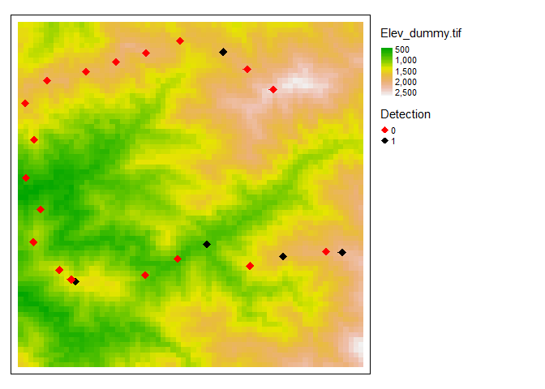
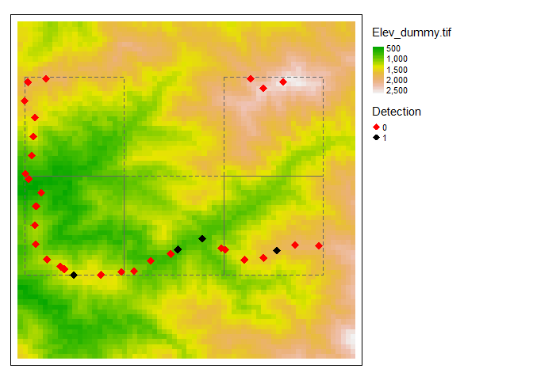

<!-- README.md is generated from README.Rmd. Please edit that file -->

# track2dm

<!-- badges: start -->
<!-- badges: end -->

The goal of **track2dm** is to create detection matrix from transect
lines that account for topography variability. The detection matrix is
usually used for hierarchical modelling of species occupancy and
distribution (see MacKenzie et al., 2004 about occupancy modelling).

## Installation

You can install the released version of track2dm and the development
version from [GitHub](https://github.com/) with:

``` r
# install.packages("devtools")
devtools::install_github("ilubis85/track2dm")
```

## How does it work?

We have provided some dataset to play with to understand how the package
works. Three types of data are needed, the track where the survey is
recorded, the observation along the track and digital elevation model
(DEM) as raster data.

``` r
# LOAD ALL DATA
# Read elevation raster data from the package
data("elevation")

# Read a survey track from the package
data("track")

# Read the observation from the package
data("observation")

# Convert dataframe (track and observation to spatial points data-frame)
track_pt <- track2dm::df2sp(track, UTMZone = "+proj=utm +zone=47 +datum=WGS84 +units=m +no_defs")
observation_pt <- track2dm::df2sp(observation, UTMZone = "+proj=utm +zone=47 +datum=WGS84 +units=m +no_defs")
```

Track is a dataframe contains date and time, X, Y and usually Z
information downloaded from GPS. Whilst observation is a dataframe
contains any information about the observed species. The elevation is
needed to extract Z values to calculate distance in three dimension
(3D).

``` r
head(track, 5)
#>               DateTime        X        Y      Z
#> 1 2015-09-10T06:27:25Z 353210.3 406622.9 627.88
#> 2 2015-09-10T06:27:31Z 353199.2 406636.3 631.24
#> 3 2015-09-10T06:27:37Z 353197.0 406651.3 634.61
#> 4 2015-09-10T06:27:42Z 353197.3 406672.5 638.45
#> 5 2015-09-10T06:27:47Z 353202.3 406685.7 642.30
head(observation, 5)
#>              DateTime    Type Age      X      Y  Observation
#> 1 2015-09-11 14:33:52 Scratch New 355976 408028 animal signs
#> 2 2015-09-12 14:34:55    Scat Old 357296 409119 animal signs
#> 3 2015-09-13 14:45:52    Scat New 359839 409959 animal signs
#> 4 2015-09-13 15:27:25    Scat New 360145 410343 animal signs
#> 5 2015-09-14 09:18:16    Scat New 360633 410947 animal signs
```

This figure below shows what the data look like when we plot them using
tmap package. The data is used with permission from WCS Indonesia and
the data has been published in journal of (TO BE UPDATED)!!.

<div class="figure" style="text-align: center">


<p class="caption">
Survey tracks and points with elevation information
</p>

</div>

So how the package works? Below is the list of functions currently
developed to create detection matrix for a species.

<table class="table" style="margin-left: auto; margin-right: auto;">
<thead>
<tr>
<th style="text-align:left;">
Function
</th>
<th style="text-align:left;">
Purpose
</th>
<th style="text-align:left;">
Arguments/inputs
</th>
</tr>
</thead>
<tbody>
<tr>
<td style="text-align:left;">
timeFormat()
</td>
<td style="text-align:left;">
reformat time
</td>
<td style="text-align:left;">
myString, addTime
</td>
</tr>
<tr>
<td style="text-align:left;">
df2Spatial()
</td>
<td style="text-align:left;">
Convert dataframe to spatial object dataframe
</td>
<td style="text-align:left;">
dataFrame, UTMZone
</td>
</tr>
<tr>
<td style="text-align:left;">
meanPoint()
</td>
<td style="text-align:left;">
Calculate the means of points
</td>
<td style="text-align:left;">
dataFrame, nPoint
</td>
</tr>
<tr>
<td style="text-align:left;">
clearPoint()
</td>
<td style="text-align:left;">
Clear the points from points
</td>
<td style="text-align:left;">
dataFrame, UTMZone, distLength
</td>
</tr>
<tr>
<td style="text-align:left;">
dist3D()
</td>
<td style="text-align:left;">
Calculate distance based on X, Y, and Z information from a dataframe
</td>
<td style="text-align:left;">
dataFrame, elevData, repLength
</td>
</tr>
<tr>
<td style="text-align:left;">
speciesDM()
</td>
<td style="text-align:left;">
Extract detection matrix from the species observation
</td>
<td style="text-align:left;">
speciesDF, speciesCol, species, extractVars
</td>
</tr>
</tbody>
</table>

## 1. Prepare track and observation points (to be updated)

We need at least three information to be able to calculate distance;
Date-Time, X and Y coordinates. Date and Time should be in as.POSIXct
format, while X and Y in numeric or double format. However, sometime
Date and Time format we got (from GPS) is in different format (mostly
as.character). For this case we need to use **track2dm::timeFormat()**
function. See codes below on how to use it and how it produces the right
format. We do the same for observation data.

``` r
# Check the structure of the data
track %>% str()
#> 'data.frame':    4706 obs. of  4 variables:
#>  $ DateTime: chr  "2015-09-10T06:27:25Z" "2015-09-10T06:27:31Z" "2015-09-10T06:27:37Z" "2015-09-10T06:27:42Z" ...
#>  $ X       : num  353210 353199 353197 353197 353202 ...
#>  $ Y       : num  406623 406636 406651 406673 406686 ...
#>  $ Z       : num  628 631 635 638 642 ...
observation %>%  str()
#> 'data.frame':    17 obs. of  6 variables:
#>  $ DateTime   : chr  "2015-09-11 14:33:52" "2015-09-12 14:34:55" "2015-09-13 14:45:52" "2015-09-13 15:27:25" ...
#>  $ Type       : chr  "Scratch" "Scat" "Scat" "Scat" ...
#>  $ Age        : chr  "New" "Old" "New" "New" ...
#>  $ X          : num  355976 357296 359839 360145 360633 ...
#>  $ Y          : num  408028 409119 409959 410343 410947 ...
#>  $ Observation: chr  "animal signs" "animal signs" "animal signs" "animal signs" ...

# Change Date and Time format 
library(stringr)
track_1 <- track %>% 
  dplyr::mutate(DateTime = track2dm::timeFormat(DateTime))

# Add +7 hours since the time format is in UTC
observation_1 <- observation %>%
  dplyr::mutate(DateTime = track2dm::timeFormat(DateTime, addTime = "07"))

# Check again the format
track_1 %>% str()
#> 'data.frame':    4706 obs. of  4 variables:
#>  $ DateTime: POSIXct, format: "2015-09-10 06:27:25" "2015-09-10 06:27:31" ...
#>  $ X       : num  353210 353199 353197 353197 353202 ...
#>  $ Y       : num  406623 406636 406651 406673 406686 ...
#>  $ Z       : num  628 631 635 638 642 ...
observation_1 %>% str()
#> 'data.frame':    17 obs. of  6 variables:
#>  $ DateTime   : POSIXct, format: "2015-09-11 21:33:52" "2015-09-12 21:34:55" ...
#>  $ Type       : chr  "Scratch" "Scat" "Scat" "Scat" ...
#>  $ Age        : chr  "New" "Old" "New" "New" ...
#>  $ X          : num  355976 357296 359839 360145 360633 ...
#>  $ Y          : num  408028 409119 409959 410343 410947 ...
#>  $ Observation: chr  "animal signs" "animal signs" "animal signs" "animal signs" ...
```

In high altitudes area like in Sumatra, GPS signals may be obstructed by
the altitude differences or simply canopy cover and thus produces less
precise points of location. This could be a huge problem because it will
calculate a bias length of distance, especially when we want to
calculate research or patrol effort (in terms of length of transect
surveys). To deal with this, functions called **track2dm::meanPoint**
or/and **track2dm::clearPoint** will be used to remove the bias either
by take means from a number of subsequent points (*meanPoint*) or clear
a certain number of points between points based on a predefined distance
(*clearPoint*). For example we used **meanPoint** for track\_1 data.

``` r
# Take means from every 10 coordinates (nPoint = 10)
track_2 <- track2dm::meanPoint(dataFrame = track_1, nPoint = 10)
```

<div class="figure" style="text-align: center">


<p class="caption">
Reducing number of points by taking the means for every 10 subsequent
points (showing the first 500 points)
</p>

</div>

Now we can combine the cleaned track and observation into one
data-frame.

``` r
# Combine both track and observation
transect <- dplyr::full_join(track_2, observation_1, by = c("DateTime", "X", "Y")) %>%
  dplyr::arrange(DateTime, X, Y)
head(transect)
#> # A tibble: 6 x 8
#>      ID DateTime                  X       Y     Z Type  Age   Observation
#>   <dbl> <dttm>                <dbl>   <dbl> <dbl> <chr> <chr> <chr>      
#> 1     1 2015-09-10 06:27:25 353215. 406684.  643. <NA>  <NA>  <NA>       
#> 2     2 2015-09-10 06:28:17 353309. 406764.  670. <NA>  <NA>  <NA>       
#> 3     3 2015-09-10 06:29:36 353303. 406824.  686. <NA>  <NA>  <NA>       
#> 4     4 2015-09-10 06:30:50 353238. 406942.  705. <NA>  <NA>  <NA>       
#> 5     5 2015-09-10 06:32:09 353270. 407080.  726. <NA>  <NA>  <NA>       
#> 6     6 2015-09-10 07:09:04 353361. 407093.  738. <NA>  <NA>  <NA>
```

## 2. Calculate distance (to be updated)

After that we can calculate the distances in three dimension (X, Y, and
Z). In order to do it, we need Z information and we can get it from
elevation data in raster format downloaded from USGS website
(<https://earthexplorer.usgs.gov>). We nead to load the elevation data
first (as we did in the beginning).

``` r
# Calculate 3D distance and matrix replicate
transect_rep <- track2dm::dist3D(dataFrame = transect, elevData = elevation,  repLength = 1000)
head(transect_rep)
#> # A tibble: 6 x 10
#>      ID DateTime                  X       Y     Z Type  Age   Observation  Dist
#>   <dbl> <dttm>                <dbl>   <dbl> <dbl> <chr> <chr> <chr>       <dbl>
#> 1     1 2015-09-10 06:27:25 353215. 406684.   673 <NA>  <NA>  <NA>           0 
#> 2     2 2015-09-10 06:28:17 353309. 406764.   693 <NA>  <NA>  <NA>         125.
#> 3     3 2015-09-10 06:29:36 353303. 406824.   708 <NA>  <NA>  <NA>         187.
#> 4     4 2015-09-10 06:30:50 353238. 406942.   719 <NA>  <NA>  <NA>         322.
#> 5     5 2015-09-10 06:32:09 353270. 407080.   725 <NA>  <NA>  <NA>         463.
#> 6     6 2015-09-10 07:09:04 353361. 407093.   736 <NA>  <NA>  <NA>         555.
#> # ... with 1 more variable: Replicate <int>
```

## 3. Extract detection matrix for species (to be updated)

Finally, we can extract detection matrix from selected species.

``` r
# Calculate 3D distance and matrix replicate
transect_dm <- track2dm::speciesDM(speciesDF = transect_rep, speciesCol = "Observation", species = "animal signs", extractVars = c("Age", "Type"))
transect_dm
#> # A tibble: 36 x 7
#>    Replicate DateTime                  X       Y Presence Age   Type   
#>        <int> <dttm>                <dbl>   <dbl> <chr>    <chr> <chr>  
#>  1         1 2015-09-10 06:27:25 353215. 406684. 0        <NA>  <NA>   
#>  2         2 2015-09-10 07:26:46 353751. 407263. 0        <NA>  <NA>   
#>  3         3 2015-09-10 09:15:36 353802. 408026. 0        <NA>  <NA>   
#>  4         4 2015-09-11 03:31:13 354691. 408109. 0        <NA>  <NA>   
#>  5         5 2015-09-11 07:00:18 355565. 407989. 1        New   Scratch
#>  6         6 2015-09-12 03:28:20 356211. 408361. 0        <NA>  <NA>   
#>  7         7 2015-09-12 07:14:15 356966. 408947. 1        Old   Scat   
#>  8         8 2015-09-13 01:53:52 357584. 409366. 0        <NA>  <NA>   
#>  9         9 2015-09-13 02:47:08 358202. 409888. 0        <NA>  <NA>   
#> 10        10 2015-09-13 05:42:26 359118. 409932. 0        <NA>  <NA>   
#> # ... with 26 more rows
```

What we really need is the matrix consists of the replications and the
species presence/absence for further occupancy analysis. This can be
done using the following script.

``` r
# transpose it and convert as dataframe 
transect_dm_1 <- transect_dm %>% dplyr::select(Presence) %>% 
  t() %>% as.data.frame()

# Use the replicate as column names
names(transect_dm_1) <- transect_dm$Replicate
transect_dm_1
#>          1 2 3 4 5 6 7 8 9 10 11 12 13 14 15 17 18 19 20 21 22 23 24 25 26 27
#> Presence 0 0 0 0 1 0 1 0 0  0  0  1  0  0  0  1  1  0  0  0  1  1  0  0  0  1
#>          28 29 30 31 34 35 36 37 38 39
#> Presence  1  0  0  0  1  1  1  0  0  0
```

This is the final result where the presence absence of species is
recorded for each track segment. This can be read as: from the first to
fourth segment, no species were recorded. It was until the fifth segment
that the species were recorded, and so on. The result would be different
if we used different replicate length (*repLength*).

**Next, how to do this for multiple tracks??**
